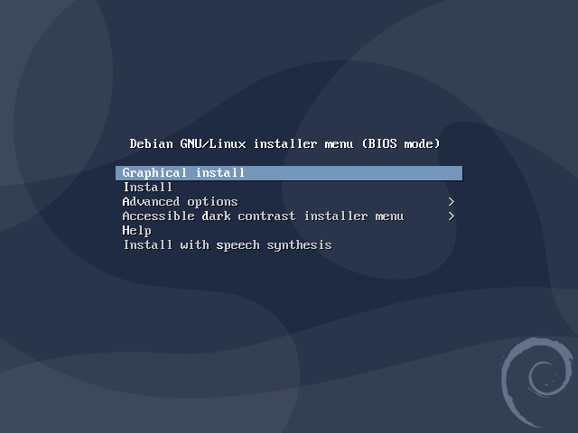

# Installatie van Debian binnen Virtual Box (v6)

Download een image bestand van Debian Net Installation :
[Debian Website](https://www.debian.org/CD/netinst/). De huidige versie ten tijde van dit schrijven (nov 2021) is *11.1.0*. Hoewel
er steeds nieuwe versies uitgegeven worden is de procedure hetzelfde. 

Kies het juiste image voor jouw architectuur (vermoedelijk AMD64). Bijvoorbeeld [deze](https://cdimage.debian.org/debian-cd/current/amd64/iso-cd/debian-11.1.0-amd64-netinst.iso) voor de laatste versie 11.0.0 (**let op** deze is niet heel lang houdbaar omdat er een versienummer in staat).

Als deze klaar is met downloaden kun je deze gebruiken om in (bijv.) VirtualBox een configuratie
aan te maken. 

## Aanmaken nieuwe VM configuratie in VirtualBox
Start VirtualBox en start het maken van een nieuwe configuratie voor een Virtuele Machine met Debian:


Klik op de button 'Nieuw' en de wizard start. 


Kies eerst een locatie (map) waar de machine opgeslagen gaat worden. Een locatie op een snelle disk heeft de voorkeur.
Kies vervolgens het type en Versie: Linux, Debian 64 bit. 


### Geheugen

De nieuwe VM heeft geheugen nodig om te kunnen werken. De keuze voor de hoeveelheid geheugen is erg afhankelijk van 
de hoeveelheid van de hoeveelheid geheugen in jouw laptop/PC, maar ook van wat je VM gaat doen. Als je VM
een Desktop-omgeving (Grafische User Interface) zoals XFCE4, GNome of Mate gaat gebruiken dan heb je meer 
geheugen nodig. Een paar handreikingen:
 * Headless: 1GB of 2GB is meer dan voldoende; 1 vCPU
 * Eenvoudige GUI (XFCE4, Mate): 2GB ; let ook op je instellingen voor videogeheugen; 1vCPU
 * Complexe GUI (Unbuntu 18 default desktop): 4GB minimaal  ;2 vCPU


### Harde schijf 

In de volgende stap maak je keuzes voor het type harde schijf dat je wilt gebruiken. Dit is een virtuele
schijf die wordt gesimuleerd door één bestand op je de echte harde schijf van je laptop/PC. De omvang
is de maximale omvang, en is later eenvoudig aan te passen mocht dat nodig zijn. We kiezen hier
voor 12GB wat meer dan voldoende moet zijn. 


De volgende keuze gaat over het type schijf. Kies hier voor VDI. 


Het is verstandig om je schijf dynamisch op te zetten. Het bestand op de harddisk van de laptop/PC 
wordt vanzelf groter als je VM meer ruimte nodig heeft. De VM denkt echter de hele tijd dat de harddisk
gewoon 12GB is. Het voordeel hiervan is dat je makkelijker backups kunt maken of makkelijker je VM kunt
delen met anderen: deze is misschien in werkelijkheid maar 2GB in omvang op je laptop/PC.


### Verdere instellingen
Het kan nuttig zijn om wat standaard systeeminstellingen even na te lopen. Bijvoorbeeld de hoeveelheid
virtuele CPU's (vCPU) die je wilt toekennen, de hoeveelheid video geheugen en eventuele video versnelling
en aanvullende opstart instellingen.

In het eerste scherm kun je instellen hoeveel geheugen je wilt toekennen, mocht dat aanpassing nodig hebben. 
 


Op het tweede tabblad (bovenin) kun je instellen hoeveel CPU's (cores) je wilt afstaan aan je VM.


Bij het tabblad "Video" kun je instellen hoeveel geheugen je voor video wilt toewijzen en of je 
2D/3D versnelling wilt gebruiken. Let op dat je voor een grafische user interface al gauw 64MB moet toewijzen om problemen te voorkomen.


### Opstartinstellingen
Nu we alles hebben ingesteld qua resources voor de VM, moeten we zorgen dat de machine kan opstarten. De eerste
keer moeten we opstarten van een ander device dan de nieuwe virtuele harddisk: we hebben immers nog niks
geinstalleerd op onze virtuele harddisk. 
We doen dit door de gedownloade ISO als CD te koppelen. Dit wordt in onderstaande schermen uitgelegd.

Ga eerst naar de instellingen van de machine. Open het tabblad 'Opslag'. 


Hier zie je de huidige instellingen van de opslag. We gaan nu een ISO-image dat je gedownload hebt koppelen als optische schijf (CD). Selecteer in de lijst met controllers en schijven de 'Controller: IDE' en daaronder het icoontje met een CD en het label 'Leeg'. 


Selecteer nu in het rechtergedeelte van het scherm  ('attributen') het icoontje met een CD en zoek je ISO image op dat je gedownload hebt. 


Je ziet nu dat het label 'leeg' vervangen is door jouw ISO image van Debian. Zet vervolgens nog het vinkje 'Live CD/DVD' zodat er meteen opgestart wordt later van deze CD. 


### Eerste opstart.
Als de configuratie klaar is, kun je de installatie starten. Klik in het hoofdscherm van VirtualBox
op de groene 'Start'-knop om de machine te starten.  


Na het opstarten verschijnt kort het startscherm van Virtual Box. 


Als de ISO/CD goed start krijg je een keuze of je de setup van Debian via een grafische interface wilt. Dit verdient
vaak wel de voorkeur zodat je met de muis en toetsenbord kunt werken.



Je bent hier vrij in het kiezen van een taal. In dit geval kies ik voor Engels.


Daarna stel je in een aantal stappen de regio in waar je je bevindt. Kies voor Europae/Netherlands.
 


Vervolgens kies je instellingen voor bijvoorbeeld je toetsenbordindeling.


Vervolgens begint deel 1 van de installatie.


De volgende stap is het detecteren van hardware zoals de klok en je netwerkkaart.


Het netwerk wordt automatisch ingesteld op DHCP: het verkrijgen van een automatisch adres.


Nu moet je de naam van de virtuele machine instellen. Dit is onder andere de naam die bijv. in het
netwerk gebruikt kan worden.


Het domein van je netwerk mag je leeglaten.


Vervolgens moet je gebruikers aanmaken. Stap 1 is het opvoeren van een wachtwoord voor de 
`root` gebruiker. Tip: schrijf dit wachtwoord op! Als je dit kwijtraakt kun je niks meer met je VM beginnen.


Voer daarna een naam in voor de tweede gebruiker. Je mag een volledige naam invoeren. Ik gebruik
hier alleen mijn voornaam.


Van de volledige naam wordt vervolgens een gebruikersnaam afgeleid die je hier nog kunt veranderen.


Voer vervolgens voor deze gebruiker ook een wachtwoord in. 


De installatie gaat verder met deel 2: het configureren van de schijf. Deze wordt het beste
ingesteld op één partitie voor alle onderdelen.


Let op: het gaat hier om een virtuele schijf! Dus je maakt geen wijzigingen op je echte harddisk van 
je computer. De 'schijf' die de installatieprocedure hier ziet is in wezen één groot bestand op je
harddisk. Virtual Box zorgt er voor dat deze door Debian als een gewone schijf wordt gezien.


Kies hier voor 'YES' om de wijzigingen door te voeren en verder te gaan. 


Kies hier voor **'No'** (in de afbeelding staat onterecht 'YES' aangevinkt)!


De packagemanager wil nu aanvullende pakketten ophalen en vraagt je om een locatie te kiezen
die dichtbij is, zodat het downloaden sneller gaat.


Je kunt ook kiezen voor bijvoorbeeld de Universiteit van Twente (debian.snt.utwente.nl).


Mocht je achter een proxy zitten dan kun je deze hier configureren.


Nu wordt dan daadwerkelijk de rest van het OS geinstalleerd.


Maak hier je eigen keuze.


De installatie start...


Na de basisinstallatie kunnen veel gebruikte pakketten geselecteerd worden. Voor een headless server gebruik
je geen desktop omgeving, dus zorg dat het bovenste pakket en de pakketten die met `...` beginnen
niet geselecteerd worden.

Zorg dat SSH *wel* aan staat! Dan kun je je server straks via SSH in ieder geval ook benaderen. 

Ik adviseer om **geen** Desktop environment te installeren. We gaan later zorgen dat je op afstand zaken kunt regelen via SSH. Kies je toch voor een Desktopomgeving, dan adviseer ik een lichtgewicht omgeving zoals LXDE of XFCE.


Na het installatieproces moet de boot-loader geinstalleerd worden. Deze zorgt er voor dat Virtual Box
je OS daadwerkelijk kan vinden en opstarten.


Installeer op de enige schijf. 


De installatie is klaar en we kunnen opnieuw opstarten.

LET OP! Als je de configuratie van de 'CD' met het installatie bestand op een andere manier hebt gekoppeld
dan kan het zijn dat je installatie proces opnieuw begint. In dat geval ga je in de configuratie
van je VM in Virtual box eerst je CD ontkoppelen voordat je opnieuw je VM opstart.


Nu wordt je VM daadwerkelijk voor de eerste keer opgestart.


Eerst krijg je het schermv an GRUB (de bootloader) te zien. Je kunt hier op <enter> drukken om door te gaan.


Daarna start het boot-proces van de VM daadwerkelijk.


Na verloop van tijd kun je inloggen. Login met `root` en je zelfgekozen wachtwoord.


Na het inloggen krijg je wat informatie over de gekozen distributie / versie.


# Backup maken
Nu je machine in de basis klaar is, is het verstandig om een kloon te maken van je VM. Dat kan eenvoudig via Virtual Box of door het **disk** bestand te kopieren.

  1. Log uit (druk op control+D)
  2. Open het menu van de virtual box --> Bestand --> Sluiten.
  3. Kies voor 'Het shutdown-signaal sturen'.
  
De machine wordt nu netjes uitgezet. 

Ga terug naar de `Oracle VM VirtualBox` en zoek je virtuele machine op. We gaan nu de kloon aanmaken:
  1. Menu-->Machine-->Kloon
  2. Kies een map
  3. Start het proces met 'Volgende'. 
  4. Kies een map
  5. Gebruik 'Volledige kloon'
  
Nadat het kloon-proces klaar is verschijnt er een nieuwe VM in je lijst met VM's. 
  

## Debian bijwerken naar laatste updates.
Hoewel je net waarschijnlijk het laatste image van Debian hebt gedownload, zijn er zeer waarschijnlijk al weer updates
verschenen. Deze kun je met onderstaande commando's bijwerken. Doe dit voordat je verder gaat. Zorg dat je bent ingelogd
als `root`! 

```bash
root@debian: ~# apt update
```
Dit commando kijkt of er updates zijn. Zo ja, dan installeer je deze met onderstaande commando:
```bash
root@debian:~# apt upgrade
```

Later willen we onze eigen user (in mijn geval `martin`) mogelijk ook commando's uit laten voeren met verhoogde rechten
(*elevated rights*). Daarvoor gebruik je dan het commando `sudo` . We gaan dit commando nu eerst installeren en kennen
vervolgens de gebruiker `martin` toe aan de groep met gebruikers die gebruik mag maken van dit commando.


```bash
root@debian:~# apt install sudo
root@debian:~# adduser martin sudo
Adding user `martin' to group `sudo' ...
Adding user martin to group sudo
Done.
root@debian:~# 
```

Later kun je dan je rechten tijdelijk verhogen of een *elevated prompt* openen. De eerste keer ziet dat er zo uit:
(login via SSH)
```bash
martin@debian:~$ sudo -i

We trust you have received the usual lecture from the local System
Administrator. It usually boils down to these three things:

    #1) Respect the privacy of others.
    #2) Think before you type.
    #3) With great power comes great responsibility.
[sudo] password for martin: 
root@debian: ~# 
root@debian: ~# who am i
martin   pts/0        2021-01-09 14:33 (192.168.123.11)
root@debian:~# 
```

# Backup maken
Nu je machine in de basis klaar is én voorzien van de laatste updates, is het verstandig om nogmaals een kloon te maken van je VM. Dat kan eenvoudig via Virtual Box of door het **disk** bestand te kopieren.

### SSH Toegang
Voor het volgen van de andere tutorials is het handig dat je op afstand kunt werken op je Virtuele Machine. Dat doen
we dan via het commando SSH. In zowel Linux (Ubuntu, Debian, Kali) en Windows 10 is dit óf standaard aanwezig of 
simpel te installeren.

**Let op**: de `root` user mag niet inloggen bij de standaard configuratie van de SSH-daemon. Maak daarom altijd eerst een andere gebruiker aan en gebruik deze om in te loggen. Heb je toch `root`-access nodig, voeg je nieuwe gebruiker dan toe aan de `sudo` groep (zie elders in deze handleidingen).

Om te zorgen dat de VM op afstand de VM via het netwerk kunnen bereiken moet je zorgen dat je VM ook een IP-adres 
krijgt dat de router van het netwerk ook kent. Standaard is dat niet zo binnen Virtual Box. 

We gaan in onderstaande eenvoudige scenario er van uit dat je **thuis** via een router werkt. Open de netwerkinstellingen 
de VM (dat kan via Virtual Box óf terwijl je VM gewoon draait via het host-menu). Voor een uitgebreide handleiding
om je netwerk goed in te stellen met Virtual Box zie [Netwerk installen](../Netwerk/README.md).


Verander de instelling bij 'Gekoppeld aan' in 'Bridged Adapter'. Sla de instellingen op met 'OK' en ga naar je VM. 
Zorg dat je ingelogd bent als `root` en voer onderstaande commando's uit:

```bash
root@debian:~# dhclient
root@debian:~# ip addr
1: lo: <LOOPBACK,UP,LOWER_UP> mtu 65536 qdisc noqueue state UNKNOWN group default qlen 1000
    link/loopback 00:00:00:00:00:00 brd 00:00:00:00:00:00
    inet 127.0.0.1/8 scope host lo
       valid_lft forever preferred_lft forever
    inet6 ::1/128 scope host 
       valid_lft forever preferred_lft forever
2: enp0s3: <BROADCAST,MULTICAST,UP,LOWER_UP> mtu 1500 qdisc pfifo_fast state UP group default qlen 1000
    link/ether 08:00:27:59:0e:97 brd ff:ff:ff:ff:ff:ff
    inet 10.0.2.15/24 brd 10.0.2.255 scope global dynamic enp0s3
       valid_lft 84971sec preferred_lft 84971sec
    inet 192.168.123.172/24 brd 192.168.123.255 scope global dynamic enp0s3
       valid_lft 85509sec preferred_lft 85509sec
    inet6 fe80::a00:27ff:fe59:e97/64 scope link 
       valid_lft forever preferred_lft forever
root@debian:~# 
```

Je ziet nu als het goed is een IP-adres dat bruikbaar is in je eigen netwerk bij enp0s3 (in mijn geval `192.168.123.172`). 

Start nu een ssh client als volgt:
```bash
ssh martin@192.168.123.172
The authenticity of host '192.168.123.172 (192.168.123.172)' can't be established.
ECDSA key fingerprint is SHA256:8jGsPFtJssdB5mHKIhC6Xe6NFmA2DTVX93H9UZ64B24.
Are you sure you want to continue connecting (yes/no)? yes
Warning: Permanently added '192.168.123.172' (ECDSA) to the list of known hosts.
martin@192.168.123.172's password: 
```

**Let op**: de eerste keer dat je verbinding maakt met zo'n computer via SSH worden sleutels uitgewisseld. De `fingerprint`
daarvan wordt opgenomen in een file (`known_hosts`) als je bevestigd dat deze correct is. Zorg dat je dus `yes` antwoord
op deze vraag.


Je bent nu verbonden met je VM 'op afstand' zodat ook vaak kopiëren/plakken werkt vanuit de rest van de tutorial.
